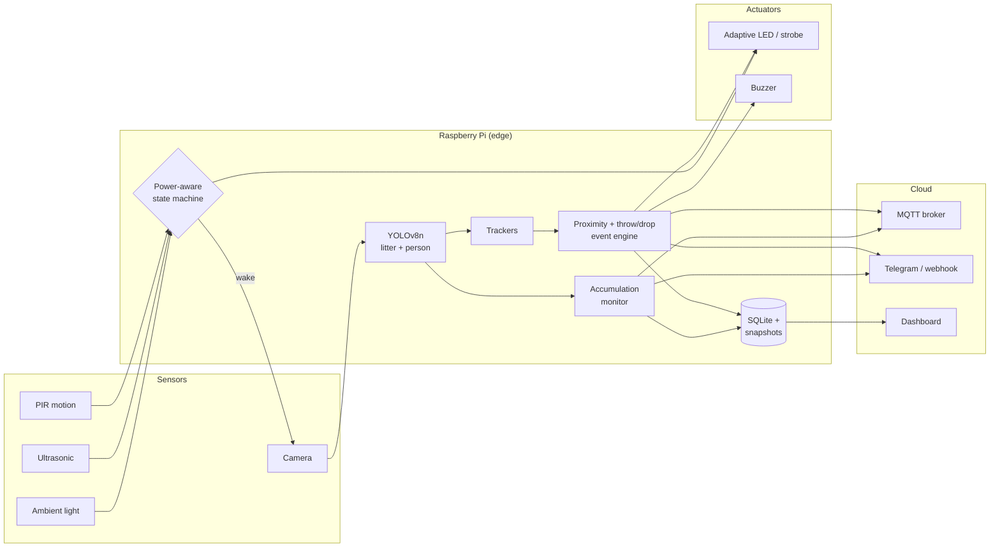

<div align="center">

# 🧹 SWACHH-AI

**An edge-computing system for real-time litter deterrence**

AI + IoT smart streetlight that *sees* littering as it happens, discourages it on the spot, and reports it.

`YOLOv8n` · `Raspberry Pi` · `PIR / Ultrasonic` · `Adaptive LED` · `MQTT / Telegram` · `Solar powered`

</div>

---

## Highlights

- **AI litter detection** – YOLOv8n fine-tuned on a 4,000+ image garbage dataset with heavy augmentation (training, evaluation and export scripts included).
- **Littering-event detection** – real-time *person–litter proximity analysis* and *throw / drop action detection* built on lightweight object tracking (no pose model required).
- **Real-time deterrence** – adaptive LED lighting (dim → bright → strobe) and buzzer the moment an offence is detected.
- **Edge-first & power-aware** – everything runs on a Raspberry Pi; PIR/ultrasonic sensors gate the AI so it sleeps when nobody is around (built for solar operation).
- **IoT reporting** – MQTT telemetry/events, Telegram alerts with evidence photo, generic webhook, SQLite log and a small web dashboard.
- **Waste monitoring** – periodic scans flag spots where litter is piling up so cleaning crews can be dispatched.
- **Privacy by design** – heads are pixelated in stored evidence images; no video is stored or streamed.

## How it works



| State | Trigger | Behaviour |
|---|---|---|
| **IDLE** | no presence | no inference (only a slow patrol scan); LED off by day / dim at night |
| **ACTIVE** | PIR or ultrasonic hit, or a person in view | inference at `active_fps`; LED brightens |
| **WATCH** | a person is carrying litter | LED to full brightness as a visible deterrent |
| **ALERT** | item thrown / dropped | LED strobe + buzzer + evidence snapshot + IoT notification |

### Littering-event logic (`swachh_ai/event_engine.py`)

All distances are measured in *person heights* and speeds in *person heights / second*, so thresholds do not depend on camera distance.

- **Proximity** – distance from a litter item's centre to the nearest person's box, divided by the person's height.
- **THROW** – an item that was held near a person leaves their neighbourhood faster than `throw_speed`, moving away from them.
- **DROP** – an item that was *carried* with a person becomes stationary and its carrier walks away.
- **Guards against false alarms** – litter merely lying next to a passer-by is not "carried"; configurable exclusion zones (dustbins); per-person cooldown.

Try it without any hardware, camera or model:

```bash
python scripts/demo_synthetic.py
# [OK ] person throws a bottle                        -> throw@2.5s
# [OK ] person puts a bottle down and walks away      -> drop@4.7s
# [OK ] person walks past existing litter             -> no event
```

## Repository layout

```
swachh-ai/
├── config/config.yaml        # all runtime settings (models, thresholds, pins, IoT)
├── data/data.yaml            # YOLO dataset definition (edit class names!)
├── training/
│   ├── augment_offline.py    # Albumentations dataset expansion
│   ├── train.py              # YOLOv8n fine-tuning
│   ├── evaluate.py           # per-class metrics -> JSON / Markdown
│   └── export_model.py       # ONNX / NCNN / OpenVINO / TFLite export for the Pi
├── swachh_ai/
│   ├── pipeline.py           # sensors -> camera -> YOLO -> analysis -> actuators -> IoT
│   ├── detector.py           # Ultralytics wrapper
│   ├── tracker.py            # lightweight multi-object tracker
│   ├── event_engine.py       # proximity + throw/drop detection
│   ├── accumulation.py       # waste-accumulation monitoring
│   ├── camera.py             # OpenCV / Picamera2 / video-file input
│   ├── hardware/             # Pi GPIO (gpiozero), mock, adaptive lighting
│   ├── iot/notifier.py       # MQTT, Telegram, webhook (non-blocking)
│   ├── store.py, vis.py      # SQLite log, overlays, privacy-preserving snapshots
│   └── simulation.py         # synthetic scenarios for tests/demo
├── dashboard/                # Flask dashboard for events & stats
├── scripts/                  # install_pi.sh, systemd unit, benchmark, synthetic demo
├── docs/                     # architecture, hardware/wiring/solar, dataset
└── tests/                    # pytest suite (runs on any laptop / CI)
```

## Quick start

### 1. Laptop / dev machine (no hardware)

```bash
git clone https://github.com/<your-username>/swachh-ai.git && cd swachh-ai
python -m venv .venv && source .venv/bin/activate
pip install -r requirements.txt
pytest -q                          # unit + pipeline smoke tests
python scripts/demo_synthetic.py   # logic demo, no model needed
```

Run on a video with your trained weights (window closes with `q`):

```bash
python -m swachh_ai.main --source path/to/street.mp4 --mock-hw --no-notify --show
```

### 2. Train your own model

```bash
pip install -r requirements-train.txt
# put your YOLO-format dataset in datasets/swachh_garbage and edit data/data.yaml
python training/augment_offline.py --src datasets/swachh_garbage --dst datasets/swachh_garbage_aug --copies 2
python training/train.py --data data/data.yaml --epochs 100 --imgsz 640
python training/evaluate.py --weights runs/train/swachh_yolov8n/weights/best.pt --split test
python training/export_model.py --weights runs/train/swachh_yolov8n/weights/best.pt --format ncnn
```

Copy the weights to `models/` and set `models.litter.weights` in `config/config.yaml`. See [`docs/dataset.md`](docs/dataset.md).

### 3. Deploy on the Raspberry Pi

```bash
./scripts/install_pi.sh                    # apt deps + venv + pip
nano config/config.yaml                    # pins, thresholds, weights path
nano .env                                  # MQTT / Telegram secrets
python scripts/benchmark.py --weights models/swachh_litter.pt   # check real FPS
python -m swachh_ai.main                   # run
sudo cp scripts/swachh-ai.service /etc/systemd/system/ && sudo systemctl enable --now swachh-ai
```

Wiring, bill of materials and solar sizing: [`docs/hardware.md`](docs/hardware.md).

### 4. Dashboard

```bash
python dashboard/app.py        # http://127.0.0.1:5000
```

## IoT interface

MQTT topics (`topic_prefix/<device_id>/…`): `event`, `telemetry`, `status` (retained `online`/`offline` via last-will).

```json
{
  "device_id": "swachh-001",
  "location": "Demo street, Bengaluru",
  "type": "throw",
  "label": "plastic_bottle",
  "confidence": 0.81,
  "timestamp": 1760000000.0,
  "extra": {"speed_person_heights_per_s": 1.76},
  "snapshot": "data/snapshots/swachh-001_20260101_120000_throw.jpg"
}
```

## Results

> Fill this in from your own runs (`training/evaluate.py` writes `results/metrics_<split>.md`).

| Class | Precision | Recall | mAP50 | mAP50-95 |
|---|---|---|---|---|
| … | … | … | … | … |

Add training curves, a confusion matrix and a short demo GIF to `docs/` and link them here.

## Limitations & responsible use

- Throw/drop detection is a **tracking-based heuristic**. A fast, motion-blurred item can be lost mid-flight, and heavy occlusion hurts accuracy. Tune thresholds on footage from *your* camera angle.
- Treat alerts as *indicators for human review*, not proof. Do not use the output for automated penalties.
- Comply with local CCTV / data-protection law: post signage, keep retention short (`max_snapshots`), keep head blurring on, and protect the dashboard with authentication.
- Litter classes are limited to what the model was trained on; performance drops at night/rain without matching training data.

## Roadmap

- [ ] Pose-based (wrist) throw detection as an optional second signal
- [ ] Track re-association for items lost mid-flight
- [ ] Coral / Hailo accelerator support
- [ ] Bin fill-level sensing (ultrasonic) fused with vision
- [ ] OTA config updates over MQTT

## License

MIT – see [LICENSE](LICENSE).
