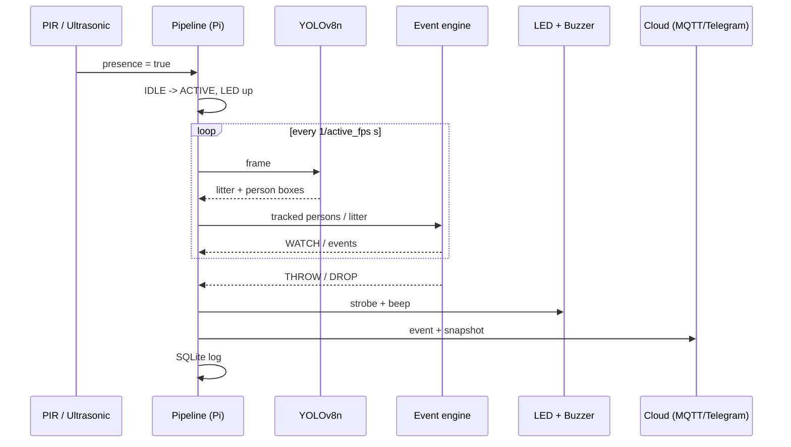

# Architecture

## Data flow

## Design decisions

| Decision | Rationale |
|---|---|
| Edge inference on the Pi | Deterrence must be immediate and work without connectivity; only small JSON events + one photo leave the device. |
| Sensor-gated AI | The camera/model dominate power draw. PIR/ultrasonic wake the pipeline; idle mode does no inference except a slow accumulation patrol. Essential for a solar budget. |
| Normalised geometry | Distances in person-heights and speeds in person-heights/s make thresholds independent of camera height and zoom. |
| Own lightweight tracker | Greedy velocity-predicted matching is dependency-free, fast on ARM and unit-testable without a GPU. |
| Two detectors (litter + COCO person) | Lets you train the litter model on garbage only. Set `models.person.weights: null` to use a `person` class inside a single model (one inference per frame). |
| Hardware abstraction + mock | The same code runs on a laptop / CI with a video file, and on the Pi with real GPIO. |
| Non-blocking IoT | A worker thread with a bounded queue: bad networks never stall the vision loop. |
| Privacy by design | Only event snapshots are stored, with heads pixelated; live video never leaves the device. |

## Tuning guide

| Symptom | Adjust |
|---|---|
| Missed throws | lower `throw_speed`, raise `active_fps`, raise `lookback_s` |
| False throws (kicked items, gestures) | raise `throw_speed` / `release_ratio` |
| False drops at bins | add an `exclusion_zones` rectangle over the bin |
| Duplicate alerts | raise `person_cooldown_s`, `iot.min_interval_s` |
| Tracks fragment on fast objects | raise `tracking.litter_max_dist_px`, raise `active_fps` |
| CPU too high | export to NCNN/ONNX, lower `imgsz`, set `person.every_n_frames: 2`, lower `active_fps` |
